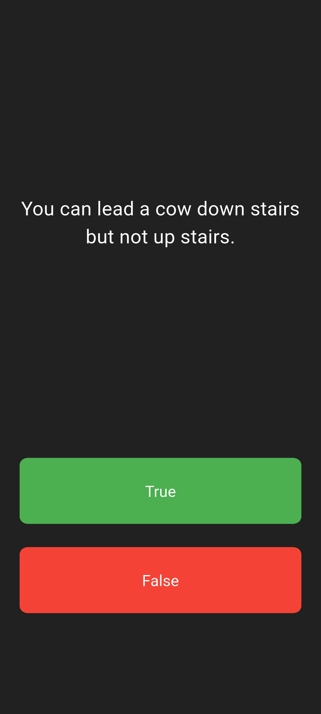
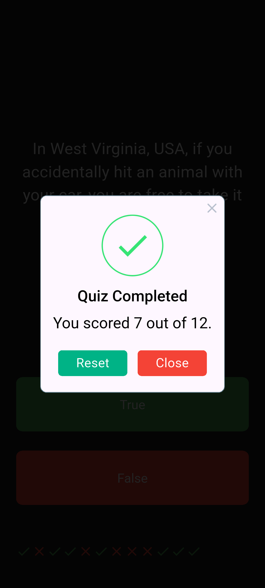

# Quiz App Project

A simple and interactive quiz application built with **Flutter**. The app presents users with a series of true/false questions, tracks their score with visual icons (green check for correct, red cross for incorrect), and provides a final score summary using a popup alert when the quiz is completed. The app uses a modular approach with a dedicated `QuizBrain` class to manage the question bank and quiz logic.


## App Preview

| Quiz Page | Quiz Completion | Quiz Dialog |

<table align="center">
  <tr>
    <td align="center">
      
      <br />
      <em>Quiz Page</em>
    </td>
    <td align="center">
      
      <br />
      <em>Quiz Completion</em>
    </td>
    <td align="center">
      
      <br />
      <em>Quiz Dialog</em>
    </td>
  </tr>
</table>

## Technologies Used

- **Flutter** - For frontend UI
- **rflutter_alert** - For interactive alerts and popups

## How to run

### Prerequisites

- Flutter SDK installed ([Installation Guide](https://flutter.dev/docs/get-started/install))
- Android Studio / VS Code with Flutter extensions
- Android emulator or physical device

### Steps

1. Clone the Repository

```bash
https://github.com/WazhmaHakimi/Quiz_App.git
```

2. Open the project in Android Studio or any IDE that you use

3. Run this command to get all the dependencies

```bash
flutter pub get
```

4. Then run this command to run the project.

```bash
flutter run
```
